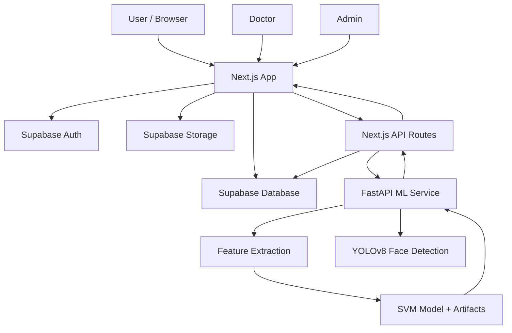
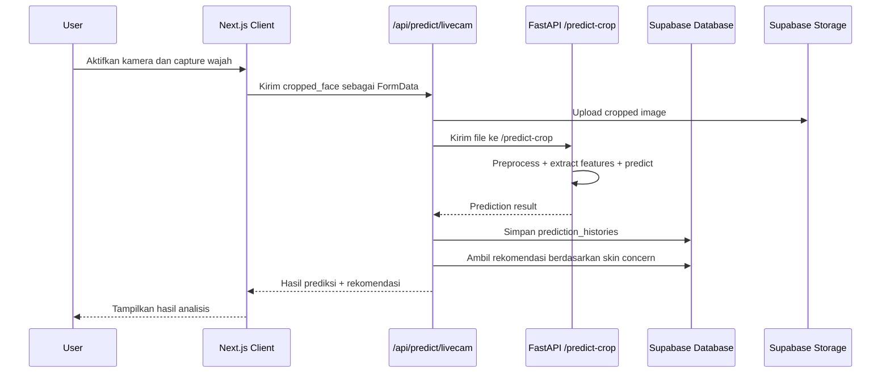
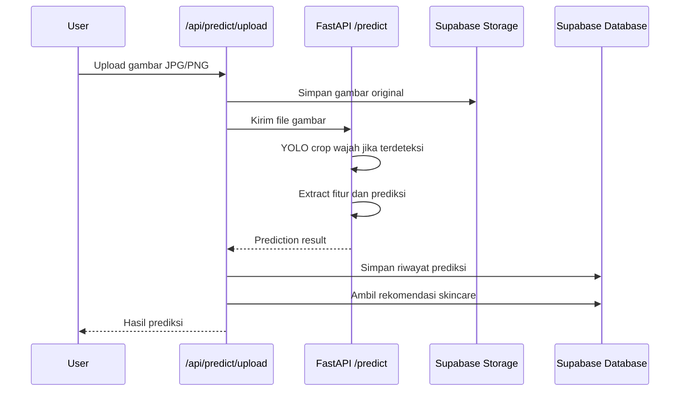

# Face Skin Detection

Aplikasi **Face Skin Detection** adalah sistem analisis kondisi kulit wajah berbasis web yang menggabungkan **Next.js**, **Supabase**, dan **FastAPI Machine Learning Service**. Sistem ini membantu pengguna melakukan pemeriksaan awal kondisi kulit melalui gambar wajah, menyimpan riwayat hasil prediksi, serta menampilkan rekomendasi perawatan kulit yang dapat dikelola oleh dokter terverifikasi.

> **Disclaimer:** Hasil analisis pada aplikasi ini bersifat prediksi awal berbasis gambar dan **tidak menggantikan diagnosis medis profesional**. Untuk kondisi kulit berat, nyeri, meradang, atau tidak membaik, pengguna tetap disarankan berkonsultasi langsung dengan dokter.

---

## Daftar Isi

- [Tentang Project](#tentang-project)
- [Fitur Utama](#fitur-utama)
- [Role Pengguna](#role-pengguna)
- [Tech Stack](#tech-stack)
- [Arsitektur Sistem](#arsitektur-sistem)
- [Alur Prediksi](#alur-prediksi)
- [Struktur Folder](#struktur-folder)
- [Environment Variables](#environment-variables)
- [Instalasi Frontend](#instalasi-frontend)
- [Instalasi ML Service](#instalasi-ml-service)
- [Model dan Artifact ML](#model-dan-artifact-ml)
- [Supabase Setup](#supabase-setup)
- [API Endpoint](#api-endpoint)
- [Catatan Integrasi](#catatan-integrasi)
- [Script yang Tersedia](#script-yang-tersedia)
- [Roadmap Pengembangan](#roadmap-pengembangan)

---

## Tentang Project

Face Skin Detection dibuat untuk membantu pengguna mengenali kemungkinan masalah kulit wajah melalui proses analisis gambar. Sistem menerima input gambar dari kamera/livecam atau upload image, lalu mengirim gambar tersebut ke service Machine Learning untuk menghasilkan prediksi kondisi kulit.

Hasil prediksi yang ditampilkan meliputi:

- kelas masalah kulit yang terdeteksi;
- tingkat confidence model;
- probabilitas per kelas;
- skor severity;
- level severity;
- rekomendasi perawatan kulit;
- riwayat pemeriksaan pengguna.

---

## Fitur Utama

### Untuk User

- Registrasi dan login user.
- Pemeriksaan kulit wajah menggunakan livecam.
- Penyimpanan gambar hasil pemeriksaan ke Supabase Storage.
- Prediksi kondisi kulit menggunakan ML service.
- Riwayat pemeriksaan berdasarkan akun user.
- Ringkasan hasil prediksi terakhir di dashboard user.
- Rekomendasi skincare berdasarkan hasil prediksi.

### Untuk Dokter

- Registrasi sebagai dokter dengan dokumen verifikasi.
- Melihat status verifikasi akun dokter.
- Mengelola produk skincare.
- Mengelola rekomendasi perawatan berdasarkan skin concern.
- Melihat daftar master skin concern.

### Untuk Admin

- Dashboard statistik sistem.
- Melihat jumlah user, dokter, admin, dokter terverifikasi, dan verifikasi tertunda.
- Manajemen user.
- Manajemen dokter terverifikasi.
- Review verifikasi dokter.
- Approve atau reject verifikasi dokter.

---

## Role Pengguna

| Role | Hak Akses |
|---|---|
| `user` | Melakukan pemeriksaan kulit, melihat hasil prediksi, melihat rekomendasi, dan melihat riwayat pemeriksaan. |
| `doctor` | Mengelola data skincare dan rekomendasi setelah akun disetujui admin. |
| `admin` | Mengelola user, dokter, dan proses verifikasi dokter. |

Middleware membatasi akses berdasarkan role:

- `/user/*` hanya untuk role `user` aktif.
- `/doctor/*` hanya untuk role `doctor`.
- Dokter yang belum approved diarahkan ke `/doctor/verification-status`.
- `/admin/*` hanya untuk role `admin` aktif.

---

## Tech Stack

### Frontend

- **Next.js 16**
- **React 19**
- **TypeScript**
- **Tailwind CSS 4**
- **Radix UI**
- **Supabase SSR**

### Backend / BaaS

- **Supabase Auth** untuk autentikasi.
- **Supabase Database** untuk profile, riwayat prediksi, skin concern, produk skincare, dan rekomendasi.
- **Supabase Storage** untuk menyimpan gambar kulit dan dokumen verifikasi dokter.

### Machine Learning Service

- **FastAPI**
- **Scikit-learn**
- **Scikit-image**
- **OpenCV**
- **Ultralytics YOLOv8**
- **Pillow**
- **NumPy**
- **SciPy**

---

## Arsitektur Sistem



---

## Alur Prediksi

### 1. Livecam Scan



### 2. Upload Image



---

## Struktur Folder

```txt
face-skin-detection/
├── app/
│   ├── (auth)/
│   │   ├── login/
│   │   ├── register/
│   │   └── actions.ts
│   ├── (user)/user/
│   │   ├── home/
│   │   ├── pemeriksaan/
│   │   ├── history/
│   │   ├── scan/
│   │   └── tips/
│   ├── (doctor)/doctor/
│   │   ├── dashboard/
│   │   ├── skincare/
│   │   ├── recommendations/
│   │   ├── skin-concerns/
│   │   └── verification-status/
│   ├── (admin)/admin/
│   │   ├── dashboard/
│   │   ├── doctor-verifications/
│   │   ├── doctors/
│   │   └── users/
│   └── api/
│       ├── auth/
│       ├── predict/
│       ├── doctor/
│       └── admin/
├── components/
│   ├── admin/
│   ├── auth/
│   ├── doctor/
│   ├── ui/
│   └── users/
├── features/
│   └── user/
├── lib/
│   ├── constants/
│   ├── supabase/
│   ├── types/
│   ├── admin-auth.ts
│   ├── auth.ts
│   └── doctor-auth.ts
├── ml-service/
│   ├── models/
│   ├── features.py
│   ├── main.py
│   └── requirements.txt
├── public/
├── middleware.ts
├── package.json
└── README.md
```

---

## Environment Variables

Buat file `.env.local` di root project Next.js.

```env
NEXT_PUBLIC_SUPABASE_URL=your_supabase_project_url
NEXT_PUBLIC_SUPABASE_PUBLISHABLE_KEY=your_supabase_publishable_key
SUPABASE_SERVICE_ROLE_KEY=your_supabase_service_role_key
NEXT_PUBLIC_ML_API_URL=http://localhost:8000
```

Keterangan:

| Variable | Fungsi |
|---|---|
| `NEXT_PUBLIC_SUPABASE_URL` | URL project Supabase. |
| `NEXT_PUBLIC_SUPABASE_PUBLISHABLE_KEY` | Public key untuk client dan SSR Supabase. |
| `SUPABASE_SERVICE_ROLE_KEY` | Service role key untuk proses admin seperti membuat user via API. Jangan expose ke client. |
| `NEXT_PUBLIC_ML_API_URL` | Base URL FastAPI ML service. |

---

## Instalasi Frontend

### 1. Clone repository

```bash
git clone https://github.com/RadityaRevanto/face-skin-detection.git
cd face-skin-detection
git checkout develop
```

### 2. Install dependencies

```bash
npm install
```

### 3. Siapkan environment

```bash
cp .env.example .env.local
```

Jika `.env.example` belum tersedia, buat manual file `.env.local` berdasarkan bagian [Environment Variables](#environment-variables).

### 4. Jalankan development server

```bash
npm run dev
```

Buka aplikasi di:

```txt
http://localhost:3000
```

---

## Instalasi ML Service

Masuk ke folder ML service:

```bash
cd ml-service
```

Buat virtual environment:

```bash
python -m venv .venv
```

Aktifkan virtual environment.

Windows:

```bash
.venv\Scripts\activate
```

macOS / Linux:

```bash
source .venv/bin/activate
```

Install dependencies:

```bash
pip install -r requirements.txt
```

Jalankan FastAPI:

```bash
uvicorn main:app --reload --port 8000
```

Cek health endpoint:

```bash
http://localhost:8000/health
```

---

## Model dan Artifact ML

ML service membutuhkan model dan artifact di folder berikut:

```txt
ml-service/models/
├── best_model.pkl
├── artifacts_v4.pkl
└── label_encoder.pkl
```

Fungsi masing-masing file:

| File | Fungsi |
|---|---|
| `best_model.pkl` | Model klasifikasi utama berbasis SVM. |
| `artifacts_v4.pkl` | Artifact preprocessing seperti scaler, PCA, dan feature selector. |
| `label_encoder.pkl` | Encoder untuk mengubah label numerik menjadi nama kelas. |

Pipeline inference:

```txt
Input Image
→ Resize 128 x 128
→ Feature Extraction
→ StandardScaler
→ PCA
→ SelectKBest
→ SVM Prediction
→ Prediction Result
```

Feature extraction menggunakan kombinasi:

- HOG
- LBP
- Color Moments
- Color Histogram
- Gabor Filter
- GLCM

---

## Supabase Setup

Project ini membutuhkan beberapa table utama di Supabase.

### Tabel Utama

| Table | Fungsi |
|---|---|
| `profiles` | Menyimpan profil user, dokter, dan admin. |
| `doctor_verifications` | Menyimpan data verifikasi dokter, STR, dokumen, status, dan alasan reject. |
| `prediction_histories` | Menyimpan riwayat prediksi user. |
| `skin_concerns` | Master data masalah kulit. |
| `skincare_products` | Produk skincare yang dikelola dokter. |
| `skin_recommendations` | Rekomendasi perawatan berdasarkan skin concern. |
| `skin_types` | Data tipe kulit untuk relasi produk skincare. |

### Storage Bucket

| Bucket | Fungsi |
|---|---|
| `skin-images` | Menyimpan gambar hasil upload dan livecam user. |
| `doctor-verification-documents` | Menyimpan dokumen verifikasi dokter. |
| `avatars` | Menyimpan avatar user jika fitur avatar digunakan. |

> Pastikan policy Supabase Storage dan RLS database sudah disesuaikan agar user hanya dapat mengakses data miliknya, dokter hanya mengelola data miliknya, dan admin dapat mengelola data verifikasi.

---

## API Endpoint

### Auth API

| Method | Endpoint | Fungsi |
|---|---|---|
| `POST` | `/api/auth/register` | Registrasi user biasa. |
| `POST` | `/api/auth/register-doctor` | Registrasi dokter dan upload dokumen verifikasi. |
| `POST` | `/api/auth/login` | Login berbasis email dan password. |
| `POST` | `/api/auth/logout` | Logout user. |
| `GET` | `/api/auth/me` | Mengambil data user dan profile aktif. |
| `GET` | `/api/auth/redirect` | Menentukan redirect berdasarkan role. |

### Prediction API

| Method | Endpoint | Fungsi |
|---|---|---|
| `POST` | `/api/predict/upload` | Prediksi dari file upload. |
| `POST` | `/api/predict/livecam` | Prediksi dari gambar hasil capture livecam. |

### Admin API

| Method | Endpoint | Fungsi |
|---|---|---|
| `POST` | `/api/admin/doctor-verifications/[id]/approve` | Approve verifikasi dokter. |
| `POST` | `/api/admin/doctor-verifications/[id]/reject` | Reject verifikasi dokter dengan alasan. |

### ML Service API

| Method | Endpoint | Fungsi |
|---|---|---|
| `GET` | `/health` | Mengecek status service, model, YOLO, dan daftar kelas. |
| `POST` | `/predict` | Prediksi dari gambar penuh, dengan YOLO crop jika wajah terdeteksi. |
| `POST` | `/predict-crop` | Prediksi dari gambar wajah yang sudah dicrop. |

---

## Catatan Integrasi

Beberapa hal yang perlu diperhatikan saat development:

1. **ML API harus aktif sebelum melakukan scan.**
   Jika `NEXT_PUBLIC_ML_API_URL` belum benar atau FastAPI belum berjalan, endpoint prediksi akan mengembalikan error.

2. **Model artifact wajib tersedia.**
   Pastikan `best_model.pkl`, `artifacts_v4.pkl`, dan `label_encoder.pkl` berada di `ml-service/models/`.

3. **Nama class prediksi dan data `skin_concerns` harus sinkron.**
   Jika ML mengembalikan class `inflammatory acne`, maka table `skin_concerns.name` juga harus memiliki nama yang bisa dimatch oleh query rekomendasi.

4. **Bucket dokumen dokter perlu distandarkan.**
   API registrasi dokter menggunakan bucket `doctor-verification-documents`. Pastikan bucket tersebut tersedia di Supabase.

5. **Severity level perlu dinormalisasi.**
   ML service mengembalikan level seperti `low`, `medium`, `high`, sedangkan beberapa type frontend menggunakan `mild`, `moderate`, `severe`. Sebaiknya gunakan satu format agar tampilan status konsisten.

6. **Root landing page masih bisa dikembangkan.**
   Halaman `/` dapat diarahkan ke landing page custom, login, atau dashboard sesuai session.

---

## Script yang Tersedia

```bash
npm run dev
```

Menjalankan Next.js development server.

```bash
npm run build
```

Membuild project untuk production.

```bash
npm run start
```

Menjalankan hasil build production.

```bash
npm run lint
```

Menjalankan ESLint.

---

## Roadmap Pengembangan

- [ ] Membuat landing page custom untuk halaman `/`.
- [ ] Menambahkan halaman upload image jika belum tersedia di UI.
- [ ] Menambahkan loading dan error boundary yang lebih konsisten.
- [ ] Menambahkan validasi normalisasi class ML ke `skin_concerns`.
- [ ] Menambahkan fitur request revision dokumen dokter.
- [ ] Menambahkan notifikasi status verifikasi dokter.
- [ ] Menambahkan chart tren riwayat kesehatan kulit user.
- [ ] Menambahkan unit test untuk auth, prediction API, dan role guard.
- [ ] Menambahkan dokumentasi SQL schema Supabase.
- [ ] Menambahkan deployment guide untuk Vercel, Supabase, dan ML service.

---

## Lisensi

Belum ada lisensi yang didefinisikan pada repository ini. Tambahkan file `LICENSE` jika project akan dipublikasikan atau digunakan secara kolaboratif.

---